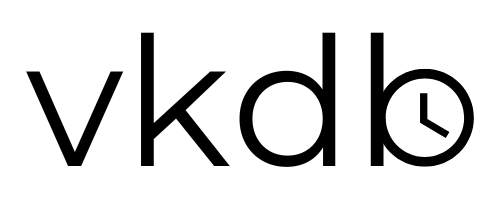
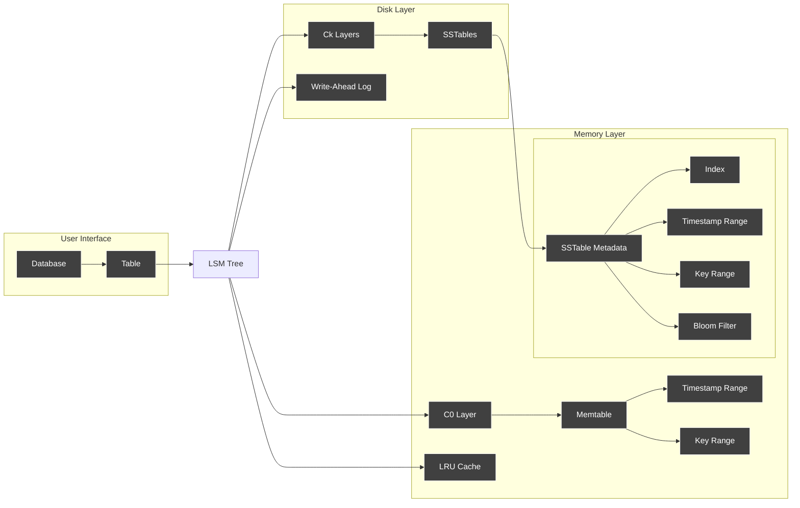
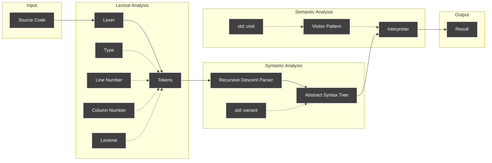

<a id="readme-top"></a>

<div align="center">
  
  <h1>vkdb</h1>
  <p>A time series database engine built in C++ with minimal dependencies.</p>
  <a href="https://cplusplus.com/">
  </a>
  <a href="https://github.com/vkayy/vkdb/graphs/contributors">
  </a>
  <a href="">
  </a>
  <a href="https://github.com/vkayy/vkdb/issues/">
  </a>
  <a href="https://github.com/vkayy/vkdb/blob/main/LICENSE">
  </a>
  <a href="https://github.com/vkayy/vkdb/stargazers">
  </a>
  <a href="https://github.com/vkayy/vkdb/network/members">
  </a>
</div>

# Table of contents

[About the project](#about-the-project)
- [Motivation](#motivation)
- [Database engine internals](#database-engine-internals)
- [Query language internals](#query-language-internals)

[Running locally (not needed)](#running-locally-not-needed)
- [Installation](#installation)
- [Tests](#tests)
- [Examples](#examples)

[Using the library](#using-the-library)
- [Setup](#setup)
- [Interface](#interface)
- [Table management](#table-management)
- [General queries](#general-queries)
- [Playground](#playground)
- [Mock data](#mock-data)

[Working with vq](#working-with-vq)
- [Table management](#table-management-1)
- [Data manipulation](#data-manipulation)
- [Errors](#errors)
- [EBNF](#ebnf)

[License](#license)

[Authors](#authors)

[Acknowledgements](#acknowledgements)

<p align="right"><a href="#readme-top">back to top</a></p>

## About the project

### Motivation

I wanted to challenge myself architecturally and push my boundaries with C++, both in terms of knowledge and performance.

<p align="right"><a href="#readme-top">back to top</a></p>

### Database engine

vkdb is built on log-structured merge (LSM) trees. In their simplest form, these have an in-memory layer and a disk layer, paired with a write-ahead log (WAL) for persistence of in-memory changes.

When you instantiate a `vkdb::Database`, all of the prior in-memory information (in-memory layer, metadata, etc.) will be loaded in if the database already exists, and if not, a new one is set up. This persists on disk until you clear it via `vkdb::Database::clear`.

It's best to make all interactions via `vkdb::Database`, or the `vkdb::Table` type via `vkdb::Database::getTable`, unless you just want to play around with vq (more on this later).

Also, one important thing to note is that all database files will be stored in `vkdb::DATABASE_DIRECTORY`; you shouldn't tamper with this directory nor the files in it.



<p align="right"><a href="#readme-top">back to top</a></p>

### Query processing

Lexing is done quite typically, with enumerated token types and line/column number stored for error messages. Initially, I directly executed queries as string streams, but that was a nightmare for robustness.

In terms of parsing, vq has been constructed to have an LL(1) grammar—this meant I could write a straightforward recursive descent parser for the language. This directly converts queries to an abstract syntax tree (AST) with `std::variant`.

Finally, the interpreter makes quick use of the AST via the visitor pattern, built into C++ with `std::variant` (mentioned earlier) and `std::visit`. This ended up making the interpreter (and pretty-printer) very satisfying to write.



<p align="right"><a href="#readme-top">back to top</a></p>

## Running locally (not needed)

### Installation

First, clone the project and `cd` into the directory.
```
git clone https://github.com/vkayy/vkdb.git && cd vkdb
```
Then, make the build directory and build the project with CMake.
```
mkdir build && cd build && cmake .. && make
```

<p align="right"><a href="#readme-top">back to top</a></p>

### Tests

From the build folder, you can run the tests.
```
./tests/vkdb_tests
```

<p align="right"><a href="#readme-top">back to top</a></p>

### Examples

From the build folder, you can also run any of the examples.
```
./examples/<filename>
```

<p align="right"><a href="#readme-top">back to top</a></p>

## Using the library

### Setup
Add this to your `CMakeLists.txt` file—it lets you use vkdb by fetching the most recent version into your project's build.

```cmake
include(FetchContent)
FetchContent_Declare(
    vkdb
    GIT_REPOSITORY https://github.com/vkayy/vkdb.git
    GIT_TAG        main
)
FetchContent_MakeAvailable(vkdb)
target_link_libraries(${PROJECT_NAME} vkdb)
```

<p align="right"><a href="#readme-top">back to top</a></p>

### Interface
Simply include the database header, and you'll have access to the database API.

```cpp
#include <vkdb/database.h>

int main()  {
  vkdb::Database db{"example-db"};
  db.createTable("example-table");
  // ...
}
```

<p align="right"><a href="#readme-top">back to top</a></p>

### Table management

You can manipulate tables with the database API, both with methods or queries.

```cpp
db.createTable("sensor_data")
  .addTagColumn("location")
  .addTagColumn("type");

db.run("REMOVE TAGS type FROM sensor_data;")
```

<p align="right"><a href="#readme-top">back to top</a></p>

### General queries

With the database API, you can run queries via strings, files, and the REPL.

```cpp
test_db
  .run("CREATE TABLE temp TAGS tag1, tag2;")
  .runFile(std::filesystem::current_path() / "../examples/vq_setup.vq")
  .runPrompt()
  .clear();
```

<p align="right"><a href="#readme-top">back to top</a></p>

With the table API, you can run queries via the query builder.

```cpp
auto sum{table_replay.query()
  .whereTimestampBetween(0, 999)
  .whereMetricIs("metric")
  .whereTagsContain({"tag1", "value1"})
  .sum()
};
```

<p align="right"><a href="#readme-top">back to top</a></p>

### Playground

You can also play around with vq by running `vkdb::VQ::run...()`. This operates on a reserved database called `interpreter_default` (which, consequently, you should not use as a database name).

```cpp
#include <vkdb/vq.h>

int main() {
  vkdb::VQ::runPrompt();
}
```

|  | 
|:--:| 
| *The vq playground REPL.* |

This is generally for experimental purposes—there's not much to gain from it in practice besides having a playground.

<p align="right"><a href="#readme-top">back to top</a></p>

### Mock data

Feel free to use `vkdb::random<>`. Any arithmetic type (with no cv- or ref-qualifiers) can be passed in as a template argument, and you can optionally pass in a lower and upper bound (inclusive).

```cpp
auto random_int{vkdb::random<int>(-100'000, 100'000)};
auto random_double{vkdb::random<double>(-10.0, 10.0)};
```

<p align="right"><a href="#readme-top">back to top</a></p>

## Working with vq

### Table management

Here are some table management queries.

```sql
CREATE TABLE climate TAGS region, season;

DROP TABLE devices;

ADD TAGS host, status TO servers;

REMOVE TAGS host FROM servers;
```

<p align="right"><a href="#readme-top">back to top</a></p>

### Data manipulation

Here are some data manipulation queries.
```sql
SELECT DATA status FROM sensors ALL;

SELECT AVG temperature FROM weather BETWEEN 1234 AND 1240 WHERE city=london, unit=celsius;

PUT temperature 1234 23.5 INTO weather TAGS city=paris, unit=celsius;

DELETE rainfall 1234 FROM weather TAGS city=tokyo, unit=millimetres;
```

<p align="right"><a href="#readme-top">back to top</a></p>

### Errors

There are two kinds of errors you can get—parse errors and runtime errors, occurring at the named points in time for self-explanatory reasons.

|  | 
|:--:| 
| *A parse error and a runtime error in the REPL.* |

<p align="right"><a href="#readme-top">back to top</a></p>

### EBNF

Here's the EBNF grammar encapsulating vq.

```bnf
<expr> ::= {<query> ";"}+

<query> ::= <select_query> | <put_query> | <delete_query> | <create_query>  | <drop_query> | <add_query> | <remove_query> | <tables_query>

<select_query> ::= "SELECT" <select_type> <metric> "FROM" <table_name> <select_clause>

<select_type> ::= "DATA" | "AVG" | "SUM" | "COUNT" | "MIN" | "MAX"

<select_clause> ::= <all_clause> | <between_clause> | <at_clause>

<all_clause> ::= "ALL" {<where_clause>}?

<between_clause> ::= "BETWEEN" <timestamp> "AND" <timestamp> {<where_clause>}?

<at_clause> ::= "AT" <timestamp> {<where_clause>}?

<where_clause> ::= "WHERE" <tag_list>

<put_query> ::= "PUT" <metric> <timestamp> <value> "INTO" <table_name> {"TAGS" <tag_list>}?

<delete_query> ::= "DELETE" <metric> <timestamp> "FROM" <table_name> {"TAGS" <tag_list>}?

<create_query> ::= "CREATE" "TABLE" <table_name> {"TAGS" <tag_list>}?

<drop_query> ::= "DROP" "TABLE" <table_name>

<add_query> ::= "ADD" "TAGS" <tag_columns> "TO" <table_name>

<remove_query> ::= "REMOVE" "TAGS" <tag_columns> "FROM" <table_name>

<tables_query> ::= "TABLES"

<tag_list> ::= <tag> {"," <tag>}*

<tag> ::= <tag_key> "=" <tag_value>

<tag_columns> ::= <tag_key> {"," <tag_key>}*

<tag_key> ::= <identifier>

<tag_value> ::= <identifier>

<metric> ::= <identifier>

<table_name> ::= <identifier>

<timestamp> ::= <number>

<value> ::= <number>

<identifier> ::= <char> {<char> | <digit>}*

<number> ::= {"-"}? <digit> {<digit>}- {"." <digit>+}?

<char> ::= "A" | ... | "Z" | "a" | ... | "z" | "_"

<digit> ::= "0" | "1" | ... | "9"
```

<p align="right"><a href="#readme-top">back to top</a></p>

## Authors

[Vinz Kakilala](https://linkedin.com/in/vinzkakilala) (me).

<p align="right"><a href="#readme-top">back to top</a></p>

## License

Distributed under the MIT License. See [LICENSE](LICENSE) for more information.

<p align="right"><a href="#readme-top">back to top</a></p>

## Acknowledgements

Used [MurmurHash3](https://github.com/aappleby/smhasher/blob/master/src/MurmurHash3.cpp) for the Bloom filters. Fast, uniform, and deterministic.

<p align="right"><a href="#readme-top">back to top</a></p>
