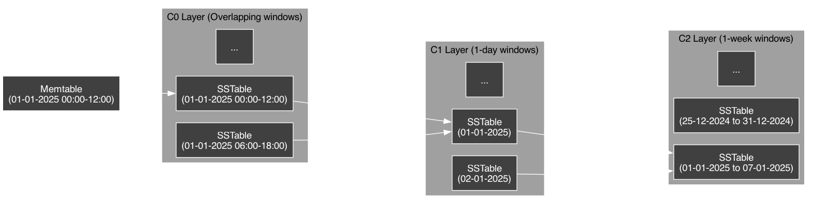

<a id="readme-top"></a>

<div align="center">
  
  <p>A time series database engine built in C++ with minimal dependencies.</p>
  <a href="https://cplusplus.com/">
    </a>
  <a href="https://github.com/vkayy/vkdb/graphs/contributors">
    </a>
  <a href="">
    </a>
  <a href="https://github.com/vkayy/vkdb/issues/">
    </a>
  <a href="https://github.com/vkayy/vkdb/blob/main/LICENSE">
    </a>
  <a href="https://github.com/vkayy/vkdb/stargazers">
    </a>
  <a href="https://github.com/vkayy/vkdb/network/members">
    </a>
  <h4>
    <a href="https://vkayy.github.io/vkdb">Documentation</a>
  </h4>
</div>

> [!NOTE]
> Development has slowed for now, as I'm a little busier with work and university!

> [!WARNING]
> vkdb is currently in the early stages of development and is not yet ready for daily use!

**vkdb** is a hobbyist time series database engine built with a focus on simplicity and modernity. Motivated by unfamiliar architectures and endless optimisation opportunities, this project is far from commercial, and is defined by a pursuit of challenge.

# Table of contents

[Internals](#internals)
- [Database engine](#database-engine)
- [Query processing](#query-processing)

[Running locally (not needed)](#running-locally-not-needed)
- [Installation](#installation)
- [Tests](#tests)
- [Benchmarks](#benchmarks)
- [Examples](#examples)

[Usage](#usage)
- [Setup](#setup)
- [Interface](#interface)
- [Table management](#table-management)
- [General queries](#general-queries)
- [Playground](#playground)
- [Mock data](#mock-data)

[Working with vq](#working-with-vq)
- [Table management](#table-management-1)
- [Data manipulation](#data-manipulation)
- [Errors](#errors)
- [EBNF](#ebnf)

[License](#license)

[Authors](#authors)

[Credits](#credits)

<p align="right"><a href="#readme-top">back to top</a></p>

## Internals

### Database engine

#### Architecture

vkdb is built on log-structured merge (LSM) trees. In their simplest form, these have an in-memory layer and a disk layer, paired with a write-ahead log (WAL) for persistence of in-memory changes.

When you instantiate a `vkdb::Database`, all of the prior in-memory information (in-memory layer, metadata, etc.) will be loaded in if the database already exists, and if not, a new one is set up. This persists on disk until you clear it via `vkdb::Database::clear`.

It's best to make all interactions via `vkdb::Database`, or the `vkdb::Table` type via `vkdb::Database::getTable`, unless you just want to play around with vq (more on the playground [here](#playground)).

> [!NOTE]
> Make sure the `$HOME` environment variable is set correctly, as all database files will be stored in `.vkdb` within your home directory. Only tamper with this directory if moving databases between machines!


<p align="right"><a href="#readme-top">back to top</a></p>

#### Compaction

The LSM tree uses time-window compaction to efficiently organise and merge SSTables across different layers (C0-C7). Each layer has a specific time window size and maximum number of SSTables.

| Layer | Time Window | Max. SSTables |
|-------|------------|--------------|
| C0 | Overlapping | 32 |
| C1 | 1 day | 2,048 |
| C2 | 1 week | 1,024 |
| C3 | 1 month | 512 |
| C4 | 3 months | 256 |
| C5 | 6 months | 128 |
| C6 | 1 year | 64 |
| C7 | 3 years | 32 |

When the memtable fills up, it's flushed to C0 as an SSTable. C0 acts as a buffer for the later layers, and when it exceeds its SSTable limit, all the SSTables are merged into C1 at once, with each SSTable spanning a 1-day window.

When any other layer exceeds its SSTable limit, only its oldest, excess SSTables are merged with the next layer's SSTables based on the layer's time window. For example, if C1 has too many SSTables:
1. The oldest SSTables from C1 are selected.
2. Any overlapping SSTables in C2 are identified based on 1-week time windows.
3. The selected SSTables are merged into new SSTables in C2.
4. Original SSTables are removed after successful merge.



This time-window compaction strategy enables:
- Fast queries, as SSTables beyond C0 are disjoint and only intersecting ranges need to be scanned.
- Efficient storage, as older data is consolidated into larger chunks whilst recent data stays granular.
- Reduced write amplification, with C0 as a buffer and merges occurring on progressively larger time windows.

<p align="right"><a href="#readme-top">back to top</a></p>

### Query processing

Lexing is done quite typically, with enumerated token types and line/column number stored for error messages. Initially, I directly executed queries as string streams, but that was a nightmare for robustness.

In terms of parsing, vq has been constructed to have an LL(1) grammar—this meant I could write a straightforward recursive descent parser for the language. This directly converts queries to an abstract syntax tree (AST) with `std::variant`.

Finally, the interpreter makes quick use of the AST via the visitor pattern, built into C++ with `std::variant` (mentioned earlier) and `std::visit`. This ended up making the interpreter (and pretty-printer) very satisfying to write.


<p align="right"><a href="#readme-top">back to top</a></p>

## Running locally (not needed)

### Installation

First, clone the project and `cd` into the directory.
```
git clone https://github.com/vkayy/vkdb.git && cd vkdb
```
Then, simply run the build script.
```
./build.sh
```

<p align="right"><a href="#readme-top">back to top</a></p>

### Tests

You can use the `-t` flag to run the tests.
```
./build.sh -t
```

<p align="right"><a href="#readme-top">back to top</a></p>

### Benchmarks

You can also use the `-b` flag to run the benchmarks.
```
./build.sh -b
```

<p align="right"><a href="#readme-top">back to top</a></p>

### Examples

Finally, you can use the `-e` flag to run any of the examples.
```
./build.sh -e <filename>
```

<p align="right"><a href="#readme-top">back to top</a></p>

## Usage

### Setup
Add this to your `CMakeLists.txt` file—it lets you use vkdb by fetching the most recent version into your project's build.

```cmake
include(FetchContent)
FetchContent_Declare(
    vkdb
    GIT_REPOSITORY https://github.com/vkayy/vkdb.git
    GIT_TAG        main
)
FetchContent_MakeAvailable(vkdb)
target_link_libraries(${PROJECT_NAME} vkdb)
```

<p align="right"><a href="#readme-top">back to top</a></p>

### Interface
Simply include the database header, and you'll have access to the database API.

```cpp
#include <vkdb/database.h>

int main()  {
  vkdb::Database db{"example-db"};
  db.createTable("example-table");
  // ...
}
```

> [!CAUTION]
> Do not instantiate multiple databases with the same name, nor a single database with the name `interpreter_default` (more on this database [here](#playground)). As these instances have in-memory components, this can cause unexpected behaviour if they (and they likely will) become out-of-sync.

<p align="right"><a href="#readme-top">back to top</a></p>

### Table management

You can manipulate tables with the database API, both with methods or queries.

```cpp
db.createTable("sensor_data")
  .addTagColumn("location")
  .addTagColumn("type");

db.run("REMOVE TAGS type FROM sensor_data;")
```

> [!IMPORTANT]
> When a table has been populated, it can no longer have its tag columns modified unless you call `vkdb::Table::clear`.

<p align="right"><a href="#readme-top">back to top</a></p>

### General queries

With the database API, you can run queries via strings, files, and the REPL.

```cpp
test_db
  .run("CREATE TABLE temp TAGS tag1, tag2;")
  .runFile(std::filesystem::current_path() / "../examples/vq_setup.vq")
  .runPrompt()
  .clear();
```

<p align="right"><a href="#readme-top">back to top</a></p>

With the table API, you can run queries via the query builder.

```cpp
auto sum{table_replay.query()
  .whereTimestampBetween(0, 999)
  .whereMetricIs("metric")
  .whereTagsContain({"tag1", "value1"})
  .sum()
};
```

<p align="right"><a href="#readme-top">back to top</a></p>

### Playground

You can also play around with vq by running `vkdb::VQ::run...()`. This operates on a reserved database called `interpreter_default`.

```cpp
#include <vkdb/vq.h>

int main() {
  vkdb::VQ::runPrompt();
}
```

|  | 
|:--:| 
| *The vq playground REPL.* |

This is generally for experimental purposes—there's not much to gain from it in practice besides having a playground.

<p align="right"><a href="#readme-top">back to top</a></p>

### Mock data

Feel free to use `vkdb::random<>`. Any arithmetic type (with no cv- or ref-qualifiers) can be passed in as a template argument, and you can optionally pass in a lower and upper bound (inclusive).

```cpp
auto random_int{vkdb::random<int>(-100'000, 100'000)};
auto random_double{vkdb::random<double>(-10.0, 10.0)};
```

<p align="right"><a href="#readme-top">back to top</a></p>

## Working with vq

### Table management

Here are some table management queries.

```sql
CREATE TABLE climate TAGS region, season;

DROP TABLE devices;

ADD TAGS host, status TO servers;

REMOVE TAGS host FROM servers;
```

<p align="right"><a href="#readme-top">back to top</a></p>

### Data manipulation

Here are some data manipulation queries.
```sql
SELECT DATA status FROM sensors ALL;

SELECT AVG temperature FROM weather BETWEEN 1234 AND 1240 WHERE city=london, unit=celsius;

PUT temperature 1234 23.5 INTO weather TAGS city=paris, unit=celsius;

DELETE rainfall 1234 FROM weather TAGS city=tokyo, unit=millimetres;
```

<p align="right"><a href="#readme-top">back to top</a></p>

### Errors

There are two kinds of errors you can get—parse errors and runtime errors, occurring at the named points in time for self-explanatory reasons.

|  | 
|:--:| 
| *A parse error and a runtime error in the REPL.* |

<p align="right"><a href="#readme-top">back to top</a></p>

### EBNF

Here's the EBNF grammar encapsulating vq.

```bnf
<expr> ::= {<query> ";"}+

<query> ::= <select_query> | <put_query> | <delete_query> | <create_query>  | <drop_query> | <add_query> | <remove_query> | <tables_query>

<select_query> ::= "SELECT" <select_type> <metric> "FROM" <table_name> <select_clause>

<select_type> ::= "DATA" | "AVG" | "SUM" | "COUNT" | "MIN" | "MAX"

<select_clause> ::= <all_clause> | <between_clause> | <at_clause>

<all_clause> ::= "ALL" {<where_clause>}?

<between_clause> ::= "BETWEEN" <timestamp> "AND" <timestamp> {<where_clause>}?

<at_clause> ::= "AT" <timestamp> {<where_clause>}?

<where_clause> ::= "WHERE" <tag_list>

<put_query> ::= "PUT" <metric> <timestamp> <value> "INTO" <table_name> {"TAGS" <tag_list>}?

<delete_query> ::= "DELETE" <metric> <timestamp> "FROM" <table_name> {"TAGS" <tag_list>}?

<create_query> ::= "CREATE" "TABLE" <table_name> {"TAGS" <tag_list>}?

<drop_query> ::= "DROP" "TABLE" <table_name>

<add_query> ::= "ADD" "TAGS" <tag_columns> "TO" <table_name>

<remove_query> ::= "REMOVE" "TAGS" <tag_columns> "FROM" <table_name>

<tables_query> ::= "TABLES"

<tag_list> ::= <tag> {"," <tag>}*

<tag> ::= <tag_key> "=" <tag_value>

<tag_columns> ::= <tag_key> {"," <tag_key>}*

<tag_key> ::= <identifier>

<tag_value> ::= <identifier>

<metric> ::= <identifier>

<table_name> ::= <identifier>

<timestamp> ::= <number>

<value> ::= <number>

<identifier> ::= <char> {<char> | <digit>}*

<number> ::= {"-"}? <digit>+ {"." <digit>+}?

<char> ::= "A" | ... | "Z" | "a" | ... | "z" | "_"

<digit> ::= "0" | "1" | ... | "9"
```

<p align="right"><a href="#readme-top">back to top</a></p>

## Authors

[Vinz Kakilala](https://linkedin.com/in/vinzkakilala) (me)

<p align="right"><a href="#readme-top">back to top</a></p>

## License

Distributed under the MIT License. See [LICENSE](https://github.com/vkayy/vkdb/blob/main/LICENSE) for more information.

<p align="right"><a href="#readme-top">back to top</a></p>

## Credits

Used [MurmurHash3](https://github.com/aappleby/smhasher/blob/master/src/MurmurHash3.cpp) for the Bloom filters. Fast, uniform, and deterministic.

<p align="right"><a href="#readme-top">back to top</a></p>
