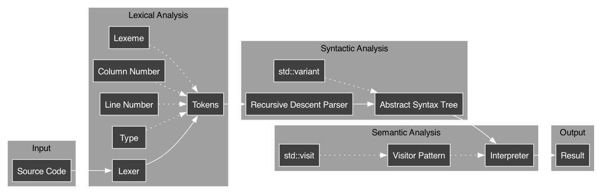

# Internals

## Database engine

vkdb is built on log-structured merge (LSM) trees. In their simplest form, these have an in-memory layer and a disk layer, paired with a write-ahead log (WAL) for persistence of in-memory changes.

When you instantiate a `vkdb::Database`, all of the prior in-memory information (in-memory layer, metadata, etc.) will be loaded in if the database already exists, and if not, a new one is set up. This persists on disk until you clear it via `vkdb::Database::clear`.

It's best to make all interactions via `vkdb::Database`, or the `vkdb::Table` type via `vkdb::Database::getTable`, unless you just want to play around with vq (read more about the playground [here](2_usage.md)).

> [!NOTE]
> All database files will be stored in `_vkdb_database_directory`; you shouldn't tamper with this directory unless you want to move your databases between machines.

## Query processing

Lexing is done quite typically, with enumerated token types and line/column number stored for error messages. Initially, I directly executed queries as string streams, but that was a nightmare for robustness.

In terms of parsing, vq has been constructed to have an LL(1) grammar—this meant I could write a straightforward recursive descent parser for the language. This directly converts queries to an abstract syntax tree (AST) with `std::variant`.

Finally, the interpreter makes quick use of the AST via the visitor pattern, built into C++ with `std::variant` (mentioned earlier) and `std::visit`. This ended up making the interpreter (and pretty-printer) very satisfying to write.

