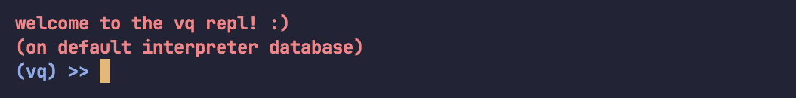

# Usage

## Running locally (not needed)

### Installation

First, clone the project and `cd` into the directory.
```
git clone https://github.com/vkayy/vkdb.git && cd vkdb
```
Then, make the build directory and build the project with CMake.
```
mkdir build && cd build && cmake .. && make
```

### Tests

From the build folder, you can run the tests.
```
./tests/vkdb_tests
```

### Examples

From the build folder, you can also run any of the examples.
```
./examples/<filename>
```

## Using the library

### Setup
Add this to your `CMakeLists.txt` file—it lets you use vkdb by fetching the most recent version into your project's build.

```cmake
include(FetchContent)
FetchContent_Declare(
    vkdb
    GIT_REPOSITORY https://github.com/vkayy/vkdb.git
    GIT_TAG        main
)
FetchContent_MakeAvailable(vkdb)
target_link_libraries(${PROJECT_NAME} vkdb)
```

### Interface
Simply include the database header, and you'll have access to the database API.

```cpp
#include <vkdb/database.h>

int main()  {
  vkdb::Database db{"example-db"};
  db.createTable("example-table");
  // ...
}
```

> [!CAUTION]
> Do not instantiate multiple databases with the same name, nor a single database with the name `interpreter_default` (more on this later). As these instances have in-memory components, this can cause unexpected behaviour if they (and they likely will) become out-of-sync.

### Table management

You can manipulate tables with the database API, both with methods or queries.

```cpp
db.createTable("sensor_data")
  .addTagColumn("location")
  .addTagColumn("type");

db.run("REMOVE TAGS type FROM sensor_data;")
```

> [!IMPORTANT]
> When a table has been populated, it can no longer have its tag columns modified unless you call `vkdb::Table::clear`.


### General queries

With the database API, you can run queries via strings, files, and the REPL.

```cpp
test_db
  .run("CREATE TABLE temp TAGS tag1, tag2;")
  .runFile(std::filesystem::current_path() / "../examples/vq_setup.vq")
  .runPrompt()
  .clear();
```

With the table API, you can run queries via the query builder.

```cpp
auto sum{table_replay.query()
  .whereTimestampBetween(0, 999)
  .whereMetricIs("metric")
  .whereTagsContain({"tag1", "value1"})
  .sum()
};
```

### Playground

You can also play around with vq by running `vkdb::VQ::run...()`. This operates on a reserved database called `interpreter_default` (which, consequently, you should not use as a database name).

```cpp
#include <vkdb/vq.h>

int main() {
  vkdb::VQ::runPrompt();
}
```

|  | 
|:--:| 
| *The vq playground REPL.* |

This is generally for experimental purposes—there's not much to gain from it in practice besides having a playground.

### Mock data

Feel free to use `vkdb::random<>`. Any arithmetic type (with no cv- or ref-qualifiers) can be passed in as a template argument, and you can optionally pass in a lower and upper bound (inclusive).

```cpp
auto random_int{vkdb::random<int>(-100'000, 100'000)};
auto random_double{vkdb::random<double>(-10.0, 10.0)};
```
